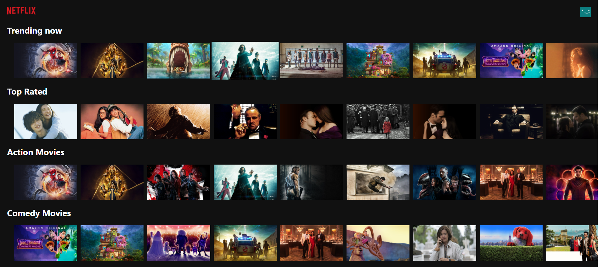

# This a React App

You will need an API_KEY from https://www.themoviedb.org/ to make this work

### `npm start`
Runs the app in the development mode.\
Open [http://localhost:3000](http://localhost:3000) to view it in your browser.

This project fetchs data about movies from TMDB and display it in rows and each row has a different move genre.
then there is the banner that display a movie from the NETFLIX ORIGNALS

npm packages used:
1. react
2. axios
3. mui
4. movie-trailer

Screenshots of the page

The first Screenshots

The second Screenshots

